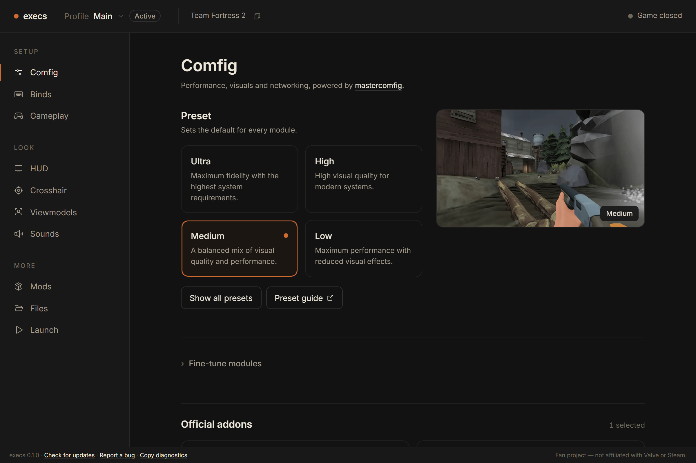
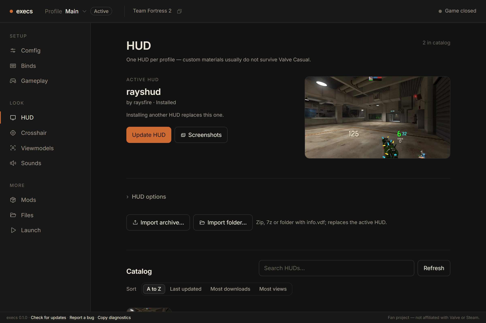
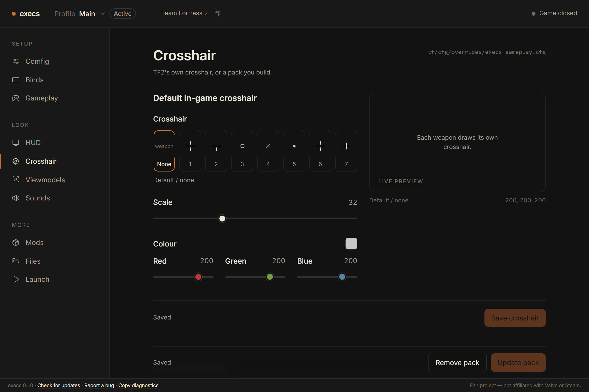
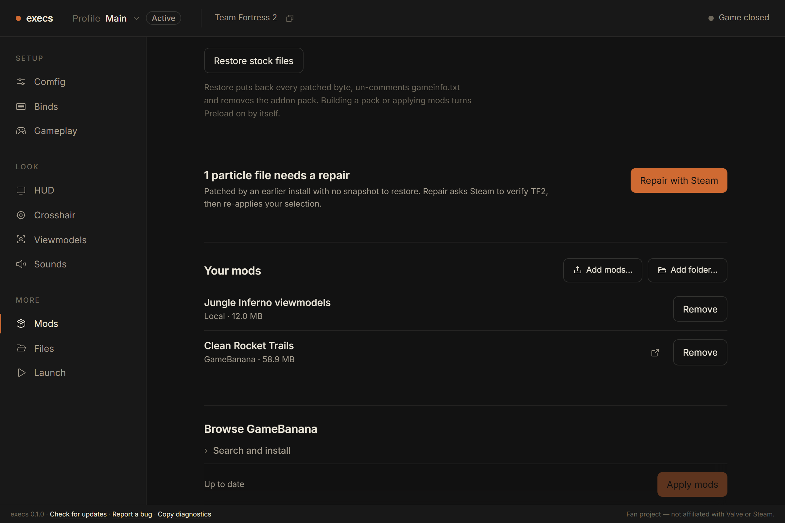
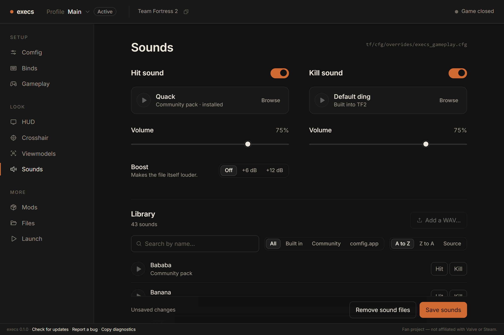
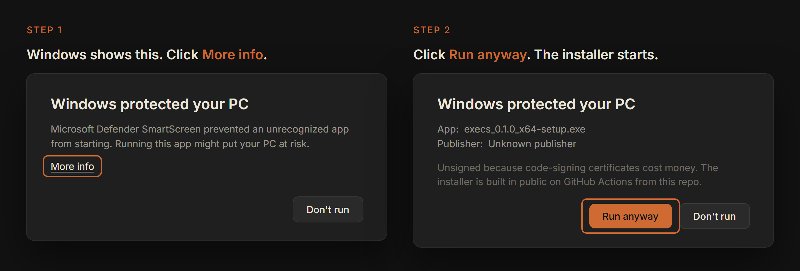

  

<h1 align="center">execs</h1>

Your Team Fortress 2 setup as profiles. Switch in one click.

  <a href="https://github.com/rndaom/execs/releases/latest"><b>Download</b></a> ·
  <a href="#install">Install</a> ·
  <a href="#files">Files</a> ·
  <a href="#bugs">Bugs</a>

## What it does

A profile is everything that makes your install yours: config, binds, HUD, crosshair, viewmodels, sounds, launch options. execs keeps profiles outside the game folder and writes the active one into `tf/custom/` and `tf/cfg/overrides/`. Never while TF2 is running. Changes made in-game flow back into the profile when the game closes.

- **Comfig.** [mastercomfig](https://comfig.app) presets, modules, addons.
- **Binds.** Click an action, press a key.
- **HUD.** Install from the hud-db catalog, tune its options, or import your own.
- **Crosshair.** Stock, 173 community crosshairs, or your own design per weapon.
- **Viewmodels.** Hide weapons per class, compiled with the game's own tools.
- **Sounds.** Hit and kill sounds from a library, or your own WAV.
- **Mods.** Bring your own packs, or browse GameBanana and install in a click. Casual preload keeps them alive on Valve servers, with one-click restore.
- **Files.** Edit any cfg with a linter that knows the engine.

  
  

  
  

## Install

Download from the [latest release](https://github.com/rndaom/execs/releases/latest). Updates are offered in-app and install only when you click.

**Windows 10 or 11, 64-bit.** Run the `-setup.exe`. It installs per user, no admin needed. The installer is not code-signed yet, so Windows warns once:

1. Click **More info**.
2. Click **Run anyway**.
3. Done. It will not ask again.

If your browser asks whether to keep the download, keep it. Each release lists SHA-256 digests so you can verify the file.

**Linux, x86_64.** The AppImage needs glibc 2.35+ (Ubuntu 22.04, Debian 12, Fedora 36 or newer). Make it executable and keep it in a folder you own, such as `~/Applications`, so updates can replace it. The `.deb` works too but does not self-update.

On first launch execs finds TF2 through Steam and asks you to confirm the folder. If you already have custom files, it offers to save them as your first profile.

## Files

| | Windows | Linux |
|---|---|---|
| Profiles, settings, caches | `%AppData%\execs` | `~/.local/share/execs` |
| Backups of patched game files | `…\execs\preloader\originals` | `…/execs/preloader/originals` |
| Crash log | `…\execs\logs\panic.log` | `…/execs/logs/panic.log` |

To remove execs, in this order:

1. Mods pane, **Restore stock files**.
2. Uninstall the app.
3. Delete the execs folder. This deletes your profiles.

If the game looks wrong afterwards, verify game files in Steam.

**Troubleshooting**

- Blank window on Linux with NVIDIA: run with `WEBKIT_DISABLE_DMABUF_RENDERER=1`.
- AppImage will not start: run it with `--appimage-extract-and-run`.
- Crash: attach the crash log to the bug report.

## Bugs

[Open an issue](https://github.com/rndaom/execs/issues/new/choose). The footer of the app has **Report a bug** and **Copy diagnostics**. Questions go in [Discussions](https://github.com/rndaom/execs/discussions).

## Credits

execs installs work by the TF2 community:

- [mastercomfig](https://github.com/mastercomfig/mastercomfig) and [hud-db](https://github.com/mastercomfig/hud-db) by [mastercoms](https://github.com/mastercoms)
- [TF2HUD.Editor](https://github.com/CriticalFlaw/TF2HUD.Editor) by [CriticalFlaw](https://github.com/CriticalFlaw)
- [CompVMInstaller](https://github.com/Yttrium-tYcLief/CompVMInstaller) by [Yttrium](https://github.com/Yttrium-tYcLief), previews by Oblique
- [casual-pre-loader](https://github.com/cueki/casual-pre-loader) by [cueki](https://github.com/cueki)
- [Venom Crosshairs](https://github.com/hbivnm/Venom-Crosshairs) by [HbiVnm](https://github.com/hbivnm) and the [list](https://github.com/hbivnm/Venom-Crosshairs-List) contributors
- [TF2Hitsounds](https://github.com/WishingStardust/TF2Hitsounds) by [WishingStardust](https://github.com/WishingStardust)
- the [comfig.app hit sounds](https://comfig.app/app/?page=hits) uploaded by their makers

Licenses and how each one is used: [THIRD_PARTY.md](THIRD_PARTY.md).

Fan project, not affiliated with Valve Corporation. Team Fortress and Steam are trademarks of Valve Corporation.

[Contributing](CONTRIBUTING.md) · [MIT license](LICENSE)
