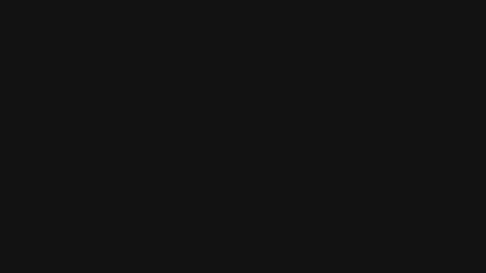
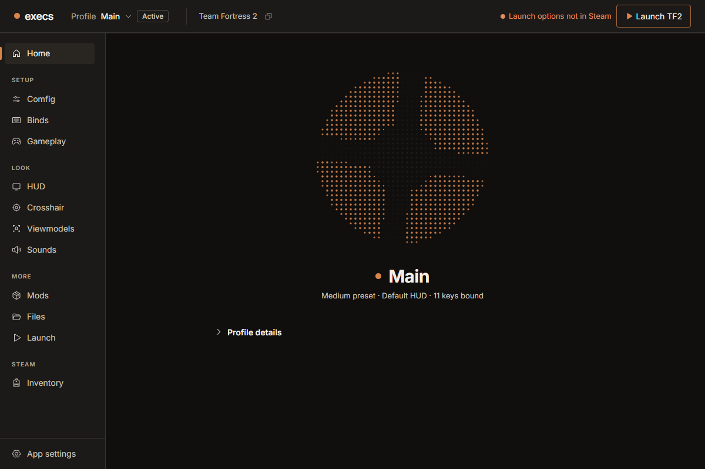
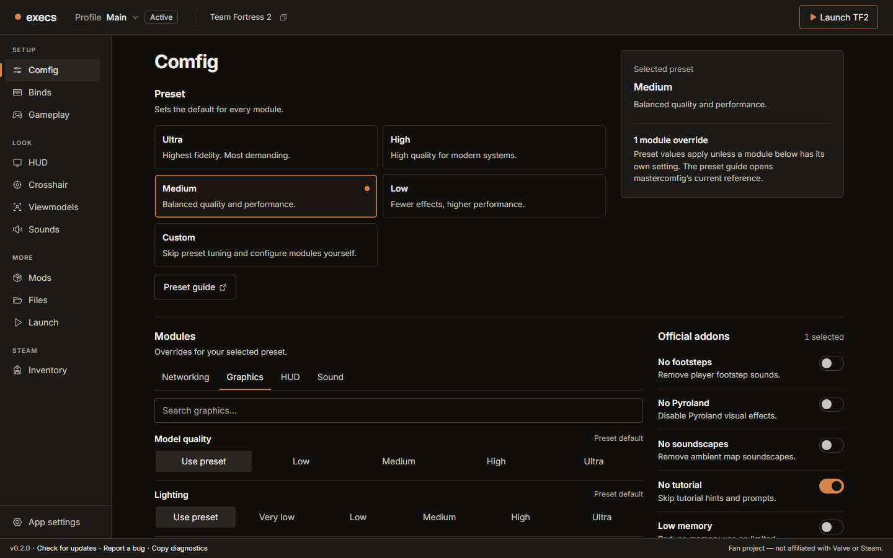

  

<h1 align="center">execs</h1>

Your Team Fortress 2 setup as profiles. Switch in one click.

  <a href="https://github.com/rndaom/execs/releases/latest"><b>Download</b></a> ·
  <a href="#install">Install</a> ·
  <a href="#files">Files</a> ·
  <a href="#bugs">Bugs</a> ·
  <a href="CHANGELOG.md">Changelog</a>

This README describes the in-development 0.2.0 branch. The Download link installs the latest public release, v0.1.8; its controls and available catalogs differ from this branch. The animation and screenshots below show unreleased development behavior. The screenshots use browser preview data, not a packaged native session.

## What it does

A profile is everything that makes your install yours: config, binds, HUD, crosshair, viewmodels, sounds, launch options. execs keeps profiles outside the game folder and writes the active one into `tf/custom/` and the player cfg layer: `tf/cfg/overrides/` with mastercomfig, or user files in `tf/cfg/` without it. Profiles also preserve `config.cfg` and its local Steam Cloud copy. These game files stay locked while TF2 runs. Changes made in-game flow back into the profile when the game closes.

- **Comfig.** [mastercomfig](https://comfig.app) presets, modules, addons.
- **Binds.** Click an action, press a key.
- **HUD.** Install from the hud-db catalog, tune its options, or import your own.
- **Crosshair.** Stock crosshairs, your own designs or PNGs per weapon, and crosshairs already saved in your profile.
- **Viewmodels.** Hide the weapon, or the weapon and hands, per weapon and class, built locally from your own TF2 files. You can also import a compatible model VPK, and earlier built packs keep working through profile switching and export/import.
- **Sounds.** Use stock hit and kill effects from your TF2 install or your own WAV.
- **Mods.** Bring your own packs, or browse GameBanana. Optional Casual preloading offers four direct-author addon choices and particle sources from your installed mods. Older saved cueki library choices need their original verified local cache; new library downloads are paused. Server rules and TF2 updates can limit what appears. **Restore stock files** reverses its gameinfo and stock-particle changes. Compatibility is not guaranteed for every mod.
- **Files.** Edit your own UTF-8 cfgs with a Source-aware linter; inspect provided cfgs read-only.
- **Profiles.** Rename, duplicate, delete, export and import profiles; compare a profile with the current one before switching; and keep local restore points you can restore as a new profile.
- **App settings.** Storage use with a safe Clear downloads, a read-only health check, update and motion preferences, and Uninstall.

### Development preview

  
  

## Install

Download from the [latest release](https://github.com/rndaom/execs/releases/latest). That published build is the only supported install; updates are offered in-app and install only when you click. What changed: [changelog](CHANGELOG.md).

**Windows 10 or 11, 64-bit.** Run the `-setup.exe`. It installs per user, no admin needed. The installer does not have an Authenticode publisher signature yet. Windows or your browser may warn on each new version; [SmartScreen reputation is specific to the file and publisher](https://learn.microsoft.com/en-us/windows/apps/package-and-deploy/smartscreen-reputation).

Before proceeding, confirm that the download comes from the published `rndaom/execs` GitHub release, that its name and version match, and that its SHA-256 digest matches the release. PowerShell's `Get-FileHash -Algorithm SHA256 .\downloaded-setup.exe` can check the downloaded file. An unsigned installer has no verified publisher identity; a matching digest checks the release bytes, not publisher signing.

If you trust that verified source and your device policy allows it, SmartScreen may offer **More info** → **Run anyway**. Do not dismiss a browser warning without checking its reason and the source. Managed devices may prohibit unsigned apps; follow your organization's policy.

**Linux, x86_64.** The AppImage needs glibc 2.35+ (Ubuntu 22.04, Debian 12, Fedora 36 or newer). Make it executable and keep it in a folder you own, such as `~/Applications`, so updates can replace it. The `.deb` works too but does not self-update.

On first launch execs finds TF2 through Steam and asks you to confirm the folder. If you already have custom files, it offers to save them as your first profile.

## Files

| | Windows | Linux |
|---|---|---|
| Profiles, settings, caches | `%AppData%\execs` | `~/.local/share/execs` |
| Backups of patched game files | `…\execs\preloader\originals` | `…/execs/preloader/originals` |
| Crash log | `…\execs\logs\panic.log` | `…/execs/logs/panic.log` |

To remove execs, open **App settings → Uninstall**. Your current TF2 setup stays installed. If Casual setup changed TF2's own files, **Restore stock files** there puts them back first. Deleting your profiles and other execs data is a separate choice. On Windows the uninstaller opens; an AppImage deletes itself; a `.deb` install shows the `apt remove` command to run.

If the game looks wrong afterwards, verify game files in Steam.

**Troubleshooting**

- Blank window on Linux with NVIDIA: run with `WEBKIT_DISABLE_DMABUF_RENDERER=1`.
- AppImage will not start: run it with `--appimage-extract-and-run`.
- Crash: review and redact personal details in the crash log before attaching it to a public bug report.

## Bugs

[Open an issue](https://github.com/rndaom/execs/issues/new/choose). The footer of the app has **Report a bug** and **Copy diagnostics**; review copied diagnostics for personal details before posting them. Questions go in [Discussions](https://github.com/rndaom/execs/discussions). A vulnerability that could write the wrong file belongs in [SECURITY.md](SECURITY.md), not a public issue.

## Credits

execs installs work by the TF2 community:

- [mastercomfig](https://github.com/mastercomfig/mastercomfig) and [hud-db](https://github.com/mastercomfig/hud-db) by [mastercoms](https://github.com/mastercoms)
- [TF2HUD.Editor](https://github.com/CriticalFlaw/TF2HUD.Editor) by [CriticalFlaw](https://github.com/CriticalFlaw)
- Previously built viewmodel packs used [CompVMInstaller](https://github.com/Yttrium-tYcLief/CompVMInstaller) by [Yttrium](https://github.com/Yttrium-tYcLief), with previews by Oblique; those remote source and preview downloads have ended; execs now builds viewmodel packs from your installed TF2 files
- [casual-pre-loader](https://github.com/cueki/casual-pre-loader) by [cueki](https://github.com/cueki)
- [Flat Textures (2021)](https://gamebanana.com/mods/295065) by [flewvar](https://gamebanana.com/members/1764119), with textures credited to [JarateKing](https://github.com/JarateKing)
- [Developer Textures Overhaul v2](https://gamebanana.com/mods/336110), a rework by FPS_Engineer; earlier material was reuploaded and continued by ayrtonSilna, who did not identify its original creator
- [Square Series](https://gamebanana.com/mods/435309), submitted by ghytd, supplies the No Burning Overlay and No Sentry Shield Overlay Casual choices
- Previously installed [Venom Crosshairs](https://github.com/hbivnm/Venom-Crosshairs) by [HbiVnm](https://github.com/hbivnm) and the [list](https://github.com/hbivnm/Venom-Crosshairs-List) contributors; new downloads are unavailable in execs
- Previously installed [TF2Hitsounds](https://github.com/WishingStardust/TF2Hitsounds) by [WishingStardust](https://github.com/WishingStardust) and [comfig.app hit sounds](https://comfig.app/app/?page=hits) uploaded by their makers; new catalog downloads are unavailable in execs

Licenses and how each one is used: [THIRD_PARTY.md](THIRD_PARTY.md).

The inventory organizer under development is inspired by
[Jengerer's Item Manager](https://www.jengerer.com/item_manager/), by Jengerer
and its contributors. It is not available in a public release yet.

Fan project, not affiliated with Valve Corporation. Team Fortress and Steam are trademarks of Valve Corporation.

[Contributing](CONTRIBUTING.md) · [Releases](docs/RELEASE.md) · [Security](SECURITY.md) · [MIT license](LICENSE)
