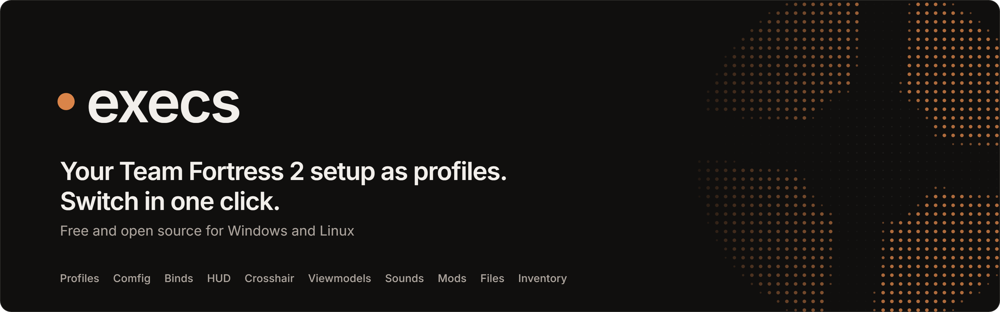
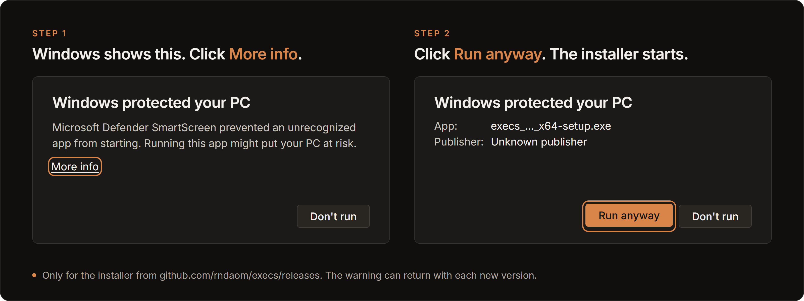

  

  <a href="https://github.com/rndaom/execs/releases/latest"><b>Download</b></a> ·
  <a href="#install">Install</a> ·
  <a href="docs/guide/README.md">Guide</a> ·
  <a href="CHANGELOG.md">Changelog</a>

  

## What it does

A profile is everything that makes TF2 yours: config, binds, HUD, crosshair, viewmodels, hit sounds, mods and launch options. Keep one for competitive, one for casual, one to try a new HUD, and switch between them while the game is closed. Switching back puts every file back exactly as it was.

- **Set it all up in one place.** mastercomfig presets, binds, FOV and sensitivity, HUDs from the community catalog, crosshairs per weapon, viewmodels, game volume and hit sounds.
- **Mods from GameBanana.** Browse, pick the file you want and install it, maps and sounds included. Casual setup loads chosen textures and particles on Valve's Casual servers.
- **Your backpack.** Sort, move and craft TF2 items, and review every change before it reaches Steam.
- **Careful with your files.** Nothing is written while TF2 runs, changes you make in game come back into the profile, and a profile exports to one ZIP you can share.

## New in 0.2.2

- **Game and music volume** are saved with each profile, so TF2 no longer resets to full volume.
- **Crosshair, rebuilt.** One gallery of TF2's crosshairs, execs shapes and your own designs, per-weapon picks, and a preview at the size you'll see in game.
- **More from GameBanana.** Sounds, maps and GUI mods install straight from Mods.
- **A short welcome tour**, and a [guide](docs/guide/README.md) for every page.

Everything else is in the [changelog](CHANGELOG.md).

<table>
  <tr>
    <td width="50%" valign="top">
      
       <b>Profiles</b> · see what switching would change
    </td>
    <td width="50%" valign="top">
      
       <b>Viewmodels</b> · shown, hidden or hands only, per weapon
    </td>
  </tr>
  <tr>
    <td width="50%" valign="top">
      
       <b>Inventory</b> · your backpack, with TF2's item art
    </td>
    <td width="50%" valign="top">
      
       <b>Files</b> · a cfg editor that knows Source
    </td>
  </tr>
</table>

## Install

Download from the [latest release](https://github.com/rndaom/execs/releases/latest).

- **Windows 10 or 11 (64-bit):** run the `-setup.exe`. No admin rights needed. The installer isn't signed yet, so Windows may say *Windows protected your PC*:

  

- **Linux (x86_64):** the AppImage updates itself; the `.deb` works too. Needs Ubuntu 22.04, Debian 12, Fedora 36 or newer.

On first launch execs finds TF2 through Steam and saves your current setup as your first profile. Updates are offered in the app and install when you click. Checking the download, where files live, uninstalling and troubleshooting: [Installing and removing](docs/guide/install.md).

## Help

- **How things work:** the [guide](docs/guide/README.md), also one click away from every page in the app.
- **Found a bug?** Use **App settings → Report a bug**, or [open an issue](https://github.com/rndaom/execs/issues/new/choose). **Copy diagnostics** adds a short report; check it for personal details first.
- **Questions:** [Discussions](https://github.com/rndaom/execs/discussions). A bug that could write the wrong file goes to [SECURITY.md](SECURITY.md), not a public issue.

## Credits

execs builds on work by the TF2 community: [mastercomfig](https://github.com/mastercomfig/mastercomfig) and [hud-db](https://github.com/mastercomfig/hud-db) by [mastercoms](https://github.com/mastercoms), [TF2HUD.Editor](https://github.com/CriticalFlaw/TF2HUD.Editor) by [CriticalFlaw](https://github.com/CriticalFlaw), [casual-pre-loader](https://github.com/cueki/casual-pre-loader) by [cueki](https://github.com/cueki), [CompVMInstaller](https://github.com/Yttrium-tYcLief/CompVMInstaller) by [Yttrium](https://github.com/Yttrium-tYcLief) for earlier viewmodel packs, and [comfig.app's hit and kill sounds](https://comfig.app/hits/), community uploads that belong to their makers. The Inventory is inspired by [Jengerer's Item Manager](https://www.jengerer.com/item_manager/). Mods and sounds are credited in the app where you use them; licenses are in [THIRD_PARTY.md](THIRD_PARTY.md).

Screenshots and the tour use execs' sample profiles; the Inventory scenes show a real backpack in execs' simulator, with the Steam account left out.

Fan project, not affiliated with Valve Corporation. Team Fortress and Steam are trademarks of Valve Corporation.

  <a href="CONTRIBUTING.md">Contributing</a> · <a href="docs/RELEASE.md">Releases</a> · <a href="SECURITY.md">Security</a> · <a href="LICENSE">MIT license</a>

