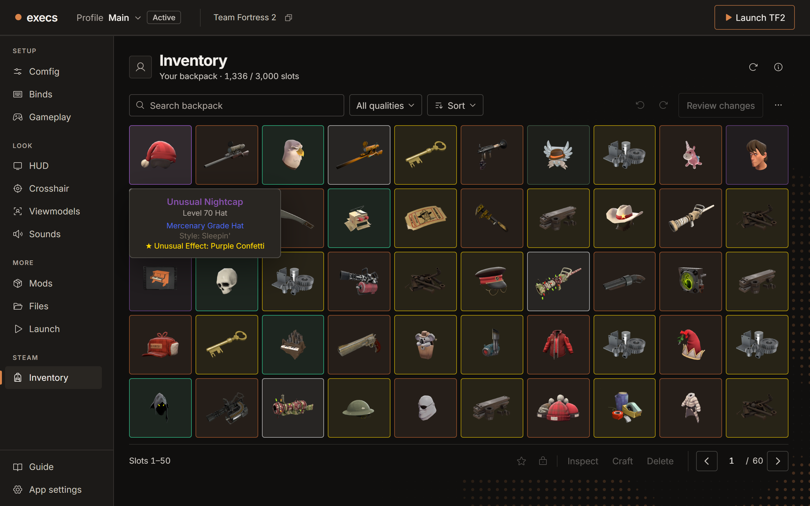
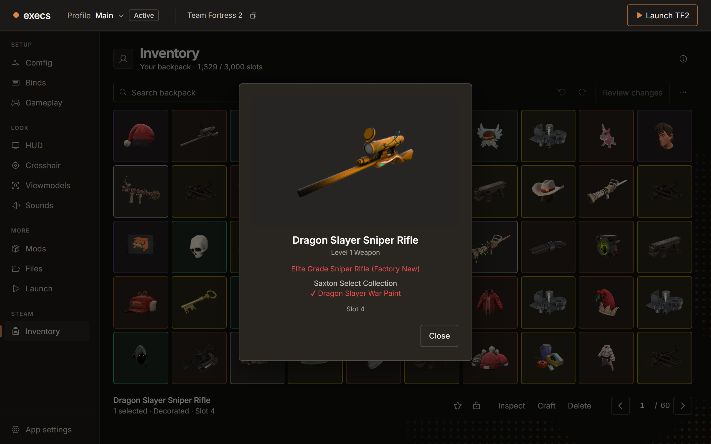
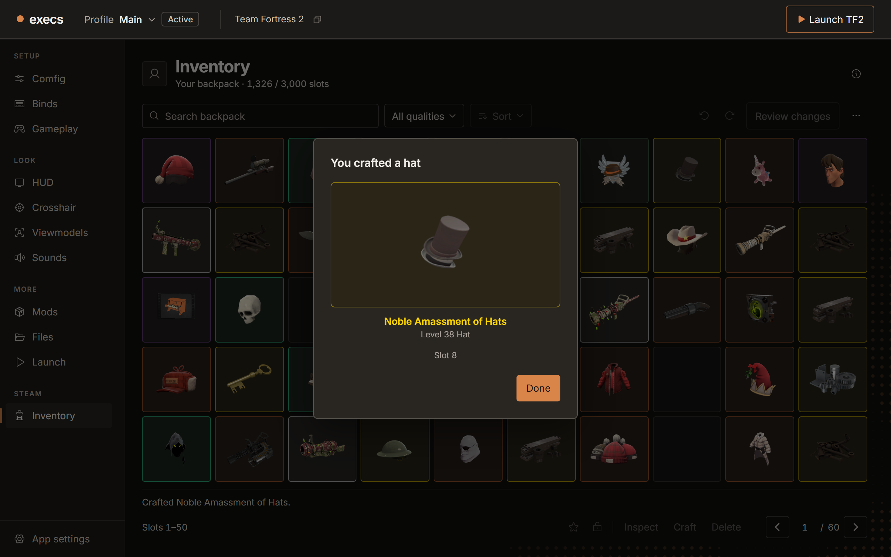
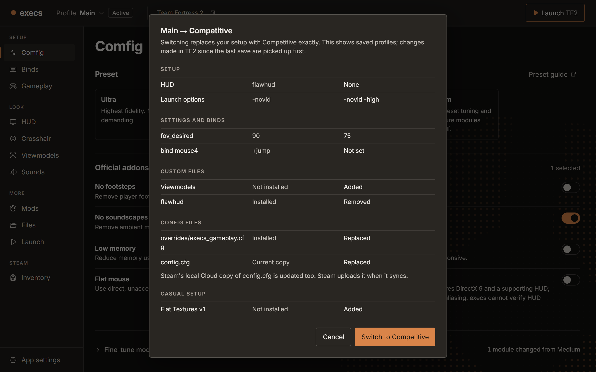
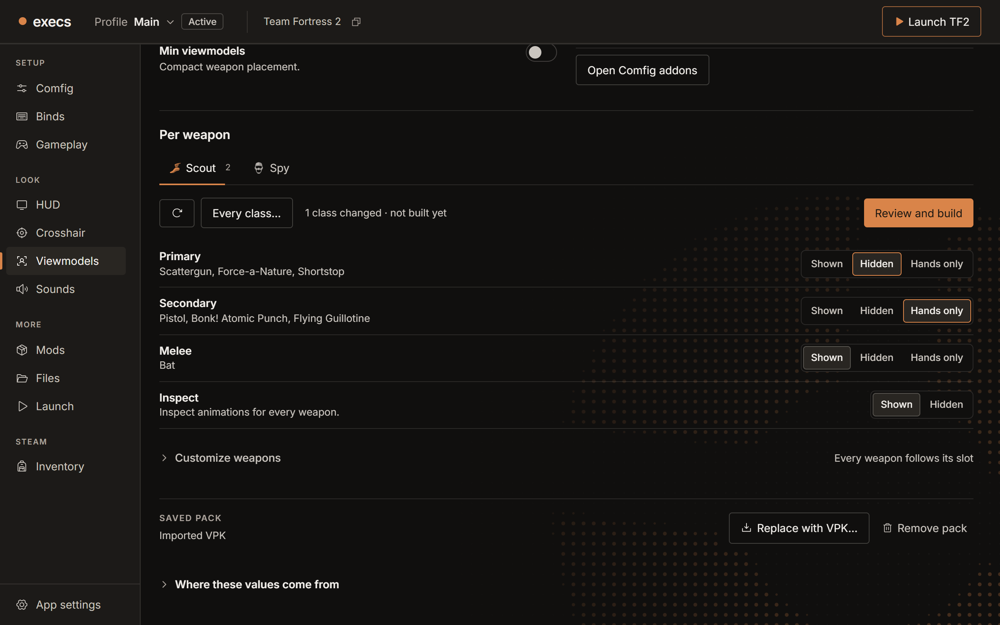
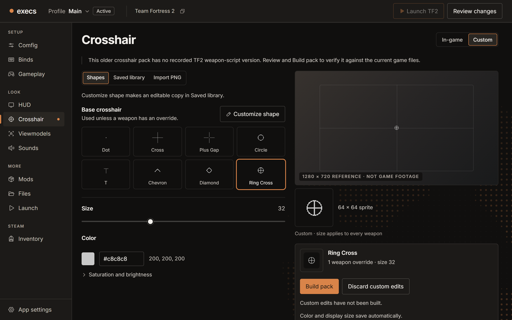
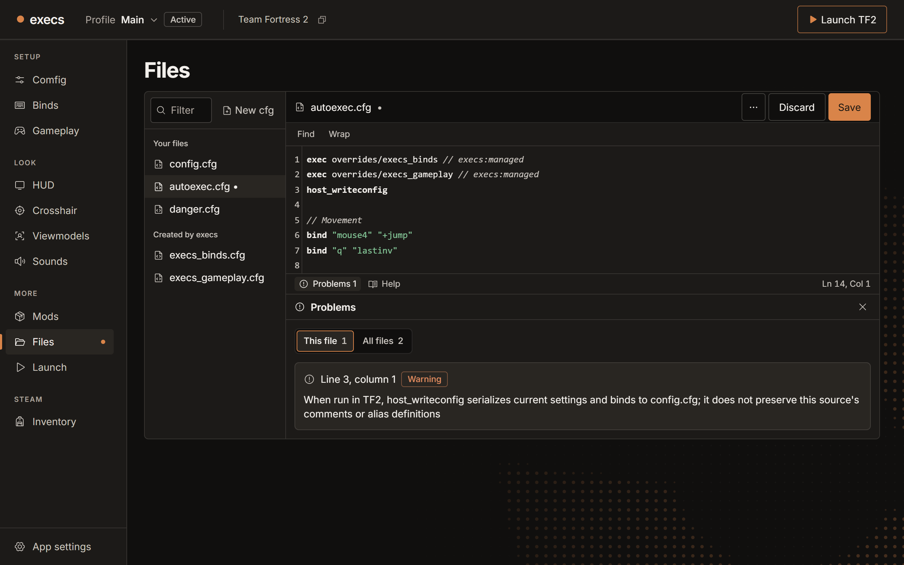
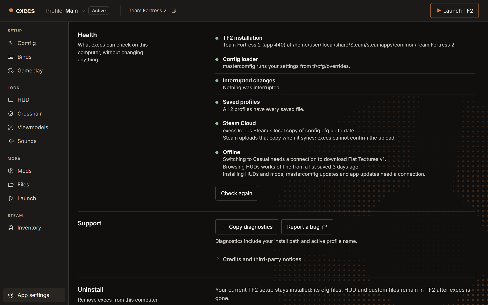

  

<h1 align="center">execs</h1>

  Your Team Fortress 2 setup as profiles. Switch in one click. 
  Free and open source for Windows and Linux

  <a href="https://github.com/rndaom/execs/releases/latest"><b>Download</b></a> ·
  <a href="#new-in-020">New in 0.2.0</a> ·
  <a href="#install">Install</a> ·
  <a href="#files">Files</a> ·
  <a href="#bugs">Bugs</a> ·
  <a href="CHANGELOG.md">Changelog</a>

  

## What it does

A profile is everything that makes your install yours: config, binds, HUD, crosshair, viewmodels, sounds, launch options. execs keeps profiles outside the game folder and writes the active one into `tf/custom/` and the player cfg layer: `tf/cfg/overrides/` with mastercomfig, or user files in `tf/cfg/` without it. Profiles also preserve `config.cfg` and its local Steam Cloud copy. These game files stay locked while TF2 runs. Changes made in-game flow back into the profile when the game closes.

- **Profiles.** Save, rename, duplicate, delete, export and import whole setups. Compare a profile with the current one before switching, and keep local restore points you can restore as a new profile.
- **Comfig.** [mastercomfig](https://comfig.app) presets, modules and official addons.
- **Binds.** Click an action, press a key. Every action sits on one page, grouped by task and searchable by name or key.
- **Gameplay.** Field of view, exact mouse sensitivity, and weapon and combat-feedback options, with the cfg file and line behind their values.
- **HUD.** Install from the hud-db catalog, tune its options, or import your own.
- **Crosshair.** Stock crosshairs, your own designs or PNGs per weapon, and crosshairs already saved in your profile.
- **Viewmodels.** Hide the weapon, or the weapon and hands, per weapon and class, built locally from your own TF2 files. You can also import a compatible model VPK, and earlier built packs keep working through profile switching and export/import.
- **Sounds.** Hit and kill sounds from TF2's own effects, the comfig.app library, or your own WAV.
- **Mods.** Bring your own packs, or browse GameBanana. Optional Casual preloading offers four direct-author addon choices and particle sources from your installed mods; **Restore stock files** reverses its gameinfo and stock-particle changes. Older saved cueki library choices need their original verified local cache, and new library downloads are paused. Server rules and TF2 updates can limit what appears, and compatibility is not guaranteed for every mod.
- **Files.** A cfg editor that knows Source: your cfgs beside one editor, problems and command help as you type, Find, and Save as new cfg. Provided cfgs open read-only.
- **Launch.** Launch options from a searchable catalog of documented choices. execs writes them to Steam before **Launch TF2**, and asks before restarting Steam.
- **Inventory.** Your TF2 backpack, read from the Steam account you are signed in to. Sort by quality, name or type, drag items across slots and pages with Undo, and review every move before it is applied to Steam. Craft metal and random hats, delete items, and protect items so sorts and crafts leave them alone. With a public Steam inventory, items show TF2's own art. The backpack belongs to your Steam account, not to a profile.
- **App settings.** Storage use with a safe Clear downloads, a read-only health check, update and motion preferences, and Uninstall.

### Screenshots

<table>
  <tr>
    <td width="50%" valign="top">
      
       <b>Inventory</b> · your backpack, with TF2's item art
    </td>
    <td width="50%" valign="top">
      
       <b>Inspect</b> · items as TF2 describes them
    </td>
  </tr>
  <tr>
    <td width="50%" valign="top">
      
       <b>Craft</b> · three Refined Metal into a random hat
    </td>
    <td width="50%" valign="top">
      
       <b>Compare with current</b> · what switching would change
    </td>
  </tr>
  <tr>
    <td width="50%" valign="top">
      
       <b>Viewmodels</b> · shown, hidden or hands only
    </td>
    <td width="50%" valign="top">
      
       <b>Crosshair</b> · pick a shape or design your own
    </td>
  </tr>
  <tr>
    <td width="50%" valign="top">
      
       <b>Files</b> · a cfg editor that knows Source
    </td>
    <td width="50%" valign="top">
      
       <b>App settings</b> · a read-only health check
    </td>
  </tr>
</table>

Screenshots and the tour use execs' built-in sample profiles. The Inventory scenes show a real TF2 backpack in execs' own simulator, with its Steam account left out. Class emblems and item images appear as execs shows them.

## New in 0.2.0

- **Inventory.** Your TF2 backpack in execs: inspect items as TF2 shows them, sort by quality, name or type, drag items anywhere and review every move before it is applied to Steam, craft metal and random hats, and delete items you no longer want.
- **Compare with current…** shows what switching to a profile would change before anything is written.
- **Restore points** keep copies of a profile that you can compare with or restore as a new profile.
- **A new cfg editor.** Files keeps your cfgs beside one editor, with problems and command help as you type, Find, and Save as new cfg.
- **Where values come from.** Gameplay, Viewmodels, Crosshair and Sounds name the cfg file and line behind each value, and warn when a later startup line would undo a change.
- **Viewmodels per weapon.** Shown, Hidden or Hands only for every weapon, class by class, built from your own TF2 files.
- **Health check.** App settings shows what execs finds without changing anything: TF2, the config loader, interrupted changes, saved profiles and the local Steam Cloud copy. Storage use with Clear downloads and Uninstall sit beside it.

Also new: rename, duplicate and delete profiles, more Gameplay options, removing any bind, launch options written to Steam, and interface zoom with Ctrl + Plus / Minus. Everything is in the [changelog](CHANGELOG.md).

## Install

Download from the [latest release](https://github.com/rndaom/execs/releases/latest). That published build is the only supported install; updates are offered in-app and install only when you click. What changed: [changelog](CHANGELOG.md).

**Windows 10 or 11, 64-bit.** Run the `-setup.exe`. It installs per user, no admin needed. The installer does not have an Authenticode publisher signature yet. Windows or your browser may warn on each new version; [SmartScreen reputation is specific to the file and publisher](https://learn.microsoft.com/en-us/windows/apps/package-and-deploy/smartscreen-reputation).

Before proceeding, confirm that the download comes from the published `rndaom/execs` GitHub release, that its name and version match, and that its SHA-256 digest matches the release. PowerShell's `Get-FileHash -Algorithm SHA256 .\downloaded-setup.exe` can check the downloaded file. An unsigned installer has no verified publisher identity; a matching digest checks the release bytes, not publisher signing.

If you trust that verified source and your device policy allows it, SmartScreen may offer **More info** → **Run anyway**. Do not dismiss a browser warning without checking its reason and the source. Managed devices may prohibit unsigned apps; follow your organization's policy.

**Linux, x86_64.** The AppImage needs glibc 2.35+ (Ubuntu 22.04, Debian 12, Fedora 36 or newer). Make it executable and keep it in a folder you own, such as `~/Applications`, so updates can replace it. The `.deb` works too but does not self-update.

On first launch execs finds TF2 through Steam and asks you to confirm the folder. If you already have custom files, it offers to save them as your first profile.

## Files

| | Windows | Linux |
|---|---|---|
| Profiles, settings, caches | `%AppData%\execs` | `~/.local/share/execs` |
| Backups of patched game files | `…\execs\preloader\originals` | `…/execs/preloader/originals` |
| Crash log | `…\execs\logs\panic.log` | `…/execs/logs/panic.log` |

To remove execs, open **App settings → Uninstall**. Your current TF2 setup stays installed. If Casual setup changed TF2's own files, **Restore stock files** there puts them back first. Deleting your profiles and other execs data is a separate choice. On Windows the uninstaller opens; an AppImage deletes itself; a `.deb` install shows the `apt remove` command to run.

If the game looks wrong afterwards, verify game files in Steam.

**Troubleshooting**

- Blank window on Linux with NVIDIA: run with `WEBKIT_DISABLE_DMABUF_RENDERER=1`.
- AppImage will not start: run it with `--appimage-extract-and-run`.
- Crash: review and redact personal details in the crash log before attaching it to a public bug report.

## Bugs

[Open an issue](https://github.com/rndaom/execs/issues/new/choose). **App settings** has **Report a bug** and **Copy diagnostics**; the first-run footer links there. Review copied diagnostics for personal details before posting them. Questions go in [Discussions](https://github.com/rndaom/execs/discussions). A vulnerability that could write the wrong file belongs in [SECURITY.md](SECURITY.md), not a public issue.

## Credits

execs installs work by the TF2 community:

- [mastercomfig](https://github.com/mastercomfig/mastercomfig) and [hud-db](https://github.com/mastercomfig/hud-db) by [mastercoms](https://github.com/mastercoms)
- [TF2HUD.Editor](https://github.com/CriticalFlaw/TF2HUD.Editor) by [CriticalFlaw](https://github.com/CriticalFlaw)
- Previously built viewmodel packs used [CompVMInstaller](https://github.com/Yttrium-tYcLief/CompVMInstaller) by [Yttrium](https://github.com/Yttrium-tYcLief), with previews by Oblique; those remote source and preview downloads have ended; execs now builds viewmodel packs from your installed TF2 files
- [casual-pre-loader](https://github.com/cueki/casual-pre-loader) by [cueki](https://github.com/cueki)
- [comfig.app hit and kill sounds](https://comfig.app/hits/), community uploads that belong to their makers

Individual mods, crosshair packs and sound collections are credited inside the app, where you use them. Licenses and how each source is used: [THIRD_PARTY.md](THIRD_PARTY.md).

The Inventory pane is inspired by
[Jengerer's Item Manager](https://www.jengerer.com/item_manager/), by Jengerer
and its contributors.

Fan project, not affiliated with Valve Corporation. Team Fortress and Steam are trademarks of Valve Corporation.

[Contributing](CONTRIBUTING.md) · [Releases](docs/RELEASE.md) · [Security](SECURITY.md) · [MIT license](LICENSE)
