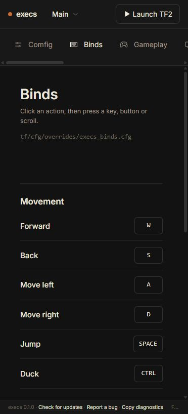
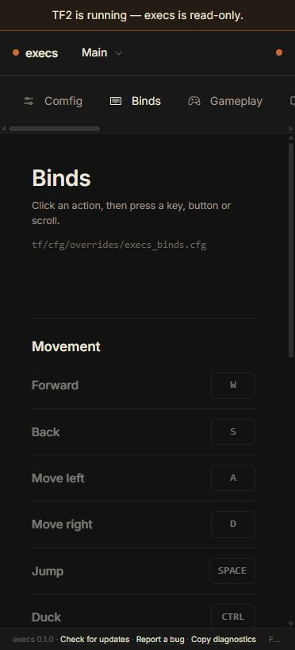
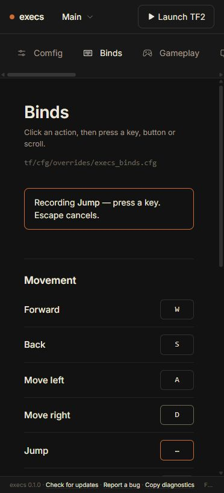
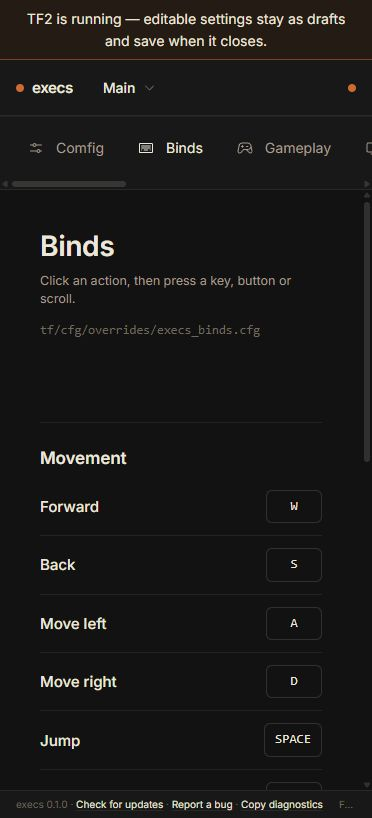
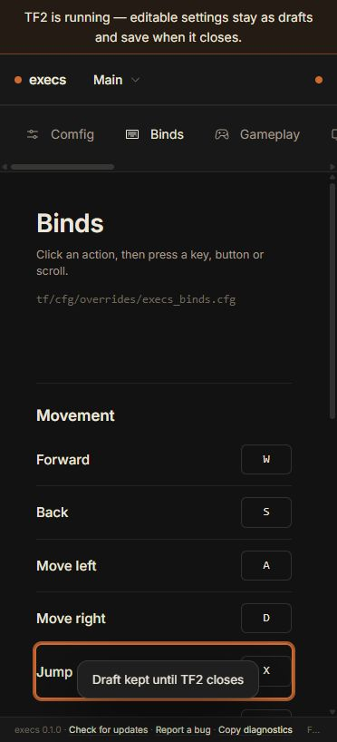

# 0.1.3 audit and implementation plan

Audited September 6, 2026. The product audit used `origin/main` at `3939937`;
the patch implementation starts from the published `v0.1.2` tag at `64b7b81`.
Main is intentionally not the patch base because it contains unreleased 0.2.0
profile-schema work and does not contain the complete 0.1.2 maintenance line.

## Release scope

| Work | Source | Acceptance |
|---|---|---|
| Deferred Binds drafts | RND-212 | Recording stays available while TF2 runs; no write occurs until unlock; retained panes keep the profile-scoped draft. |
| Mouse button names | RND-233 | DOM primary/right/middle/side buttons map to Source `mouse1` through `mouse5`; the synthetic `Mouse0`-`Mouse4` fallback remains correct. |
| In-game unbinds | RND-234 | A complete post-absorb `config.cfg` read removes absent tracked assignments and handles moves, swaps and multiple keys without importing unrelated binds. |
| Mid-operation write lock | RND-254 | Restore, repair and config/Cloud publication stop before the next mutation if TF2 appears during absorb. |
| Imported HUD identity | RND-253 | Matching a differently named local HUD to the catalog does not break schema options, export or switching. |
| Profile ZIP round trip | RND-255 | A small highly compressible asset exported by execs imports again; large expansion bombs and byte caps remain refused. |

New features, creator ZIP/profile-preloader schema work, Binds secondary-key UI,
and general main-branch reconciliation remain outside this patch.

## Captured Binds flow

### 1. Open Binds — healthy baseline

The pane has a clear heading, short instruction and accessible record controls.
At the captured narrow viewport the top settings navigation overflows
horizontally; this is evidence for responsive follow-up, not a 0.1.3 blocker.

### 2. Open Binds while TF2 runs — unhealthy before fix

Every record control is disabled and the banner says the whole app is
read-only. That contradicts the existing draft/autosave contract and prevents a
player from preparing changes during a match.

### 3. Start recording — healthy baseline interaction

The selected row, recording panel and Escape instruction expose the transient
state clearly. Keyboard and mouse behavior still require automated and native
interaction tests beyond the screenshot.

### 4. Open Binds while TF2 runs — healthy after fix

Record controls remain available and the single top banner now explains that
editable settings stay as drafts until TF2 closes. Heavy actions elsewhere
remain locked.

### 5. Record a locked draft — healthy after fix

The row immediately reflects the new key and the existing toast confirms the
deferred behavior. Tests must establish the safety claim that no backend write
occurs while locked; a screenshot cannot prove it.

## Repository and delivery findings

- GitHub has no open issue, pull request or discussion supplying additional
  0.1.3 scope. Public 0.1.2 and current main CI are green.
- `main` and the maintenance line have diverged. After 0.1.3, released version,
  changelog and workflow hardening should be reconciled back into main without
  merging the minor-only profile work into this patch.
- Branch protection, dependency alerts, secret scanning and code scanning are
  not enabled. Those governance changes are separate from the desktop patch.
- Source review found additional accessibility and product follow-ups, including
  low-contrast secondary text and several non-native control semantics. They
  need focused runtime verification before being scheduled.

## Evidence limits

The visual run used the browser preview at the narrow Codex viewport. The full
frontend, release-script and locked Rust test suites, Biome, production build,
Rustfmt and strict Clippy pass on the implementation branch. This run does not
exercise native Tauri IPC, a real TF2 process transition, Steam Cloud, screen
readers, zoom/reflow or packaged Windows/Linux behavior. Those native and
packaged gates remain required before a 0.1.3 tag.
