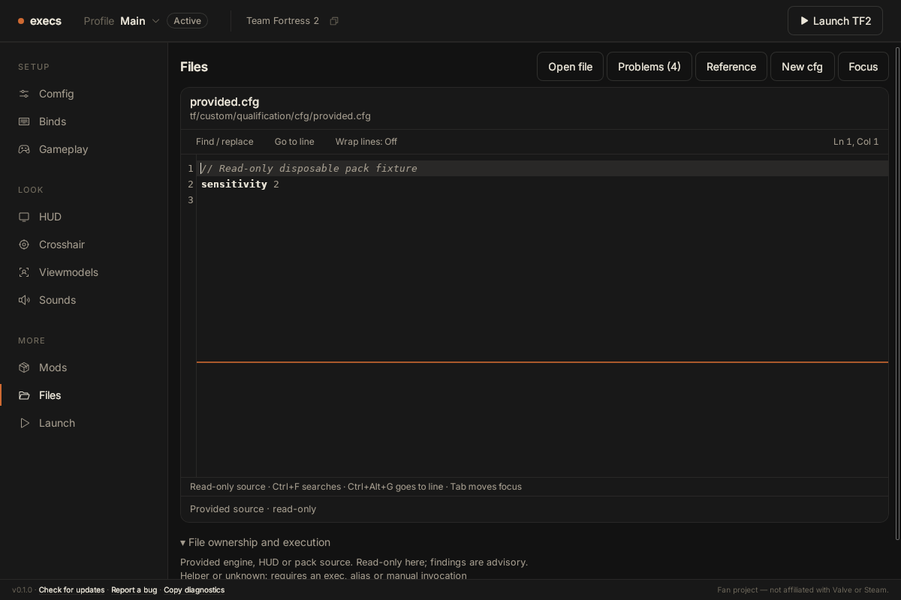

# Linux native Files qualification

[Run 35490611803](https://github.com/rndaom/execs/actions/runs/35490611803),
Linux job 106024773948, passed at
`0ff59b451f4c5f629133e8b64313d569a0116b7f`.
The complete `files-native-linux` artifact contains all four layout captures,
AT-SPI snapshots, full Orca debug log and exact fixture measurements.

Ubuntu 22.04, AMD EPYC 9V74 with four logical CPUs, WebKitGTK 2.50.4,
Orca 42.0, IBus 1.5.26 and Anthy 1.5.14. This is a disposable native-engine
host of production-built frontend assets with the product CSP header and an
in-memory preview adapter. No real game, profile, Cloud or native save IPC is
involved. The fixture footer's v0.1.0 is not the candidate product version.

## Interaction and speech

Physical Tab entry/exit, find, go-to-line, completion and acceptance passed.
Real IBus Anthy composition committed `日本語`; Orca also spoke that committed
text. The public DOM authoring workflow passed all nine stages: create helper,
numeric diagnostic selection, bundled reference, two retained drafts, exec
navigation, exact save/reopen, find, go-to-line and focusable read-only source.
These scripted workflow actions are distinct from the physical keyboard phase.

The actual generated Orca speech includes:

- Editable file path and shortcut instructions.
- `sensitivity · cvar` and its pinned-source provenance.
- Problem path with line/column, followed by `banana` and `selected`.
- Save buttons and file entries whose `Unsaved` label disappears after saving.
- Provided file path and explicit `Read-only source` navigation instructions.

**Unobserved:** the explicit `Saved` status and full numeric-warning prose were
not spoken in this run. DOM text, correct selection and save/reopen assertions
do not establish these missing speech observations. Orca used its WebKitGtk
document script; the initial generic GTK script is not an explanation for this
gap. Windows NVDA separately spoke both full warning and save result. The green
Linux job requires editor speech, not every acceptance announcement.

Two bounded follow-ups investigated these observations without modifying product
code. [Run 35491252328](https://github.com/rndaom/execs/actions/runs/35491252328)
at `9108321` used documented desktop flat review (KP8 then four KP9 commands)
from the scrolled, focused problem location. Only the frame title was spoken.
[Run 35491407031](https://github.com/rndaom/execs/actions/runs/35491407031)
at `62a0797` used documented document Say All (KP Plus) from the same location.
The log confirms `Handler is Speak entire document`, but no warning prose was
generated. The adjacent paragraph text and precise argument navigation pass
separately; full warning speech remains unverified on this reader/host.

Both follow-ups held focus stationary for five seconds after each acknowledged
save. Explicit Saved speech remained absent, so immediate focus movement is not
a sufficient explanation. The [captured AT-SPI event](linux/polite-status-event.txt)
exposes a status-bar child addition with `live:polite`, `atomic:true`, and
`container-live:polite`. Product Toast already uses an always-mounted polite
status region. Orca 42's [WebKitGtk script](https://github.com/GNOME/orca/blob/ORCA_42_0/src/orca/scripts/toolkits/WebKitGtk/script.py#L55)
inherits the default script and does not override child-add handling; the
[default handler is empty](https://github.com/GNOME/orca/blob/ORCA_42_0/src/orca/scripts/default.py#L2128).
This source behavior and the observed event explain the absent automatic
announcement on this stack; they do not establish a malformed product status
region or justify claiming the required spoken result passed.

[Settled-save speech](linux/settled-save-speech.txt),
[Say All speech and handler](linux/say-all-speech.txt), and
[follow-up workflow assertions](linux/speech-followup-workflows.json) preserve
the observations. Commands were checked against the [GNOME flat-review guide](https://help.gnome.org/orca/commands_flat_review.html),
[reading guide](https://help.gnome.org/orca/commands_reading.html), and exact
[Orca 42 keymap](https://github.com/GNOME/orca/blob/ORCA_42_0/src/orca/desktop_keyboardmap.py#L53).
These targeted runs explicitly omit keyboard, IME and performance qualification;
the earlier passing measurements remain unchanged. The preceding full rerun
35491095523 failed before speech review because physical completion intermittently
retained only the first prefix character under Orca. That failure is not erased
by the targeted runs or represented as a new passing keyboard observation.

See [speech excerpts](linux/speech-excerpts.txt) and
[workflow assertions](linux/workflows.json). Vanilla autoexec creation, native
external-source conflict and persistence/transition guarantees remain mapped to
the separate core/IPC/frontend integration regressions, not this fixture run.

## Measured performance

| Measurement | Result |
| --- | --- |
| Navigation to editor and settled analysis | 546 ms |
| Ordinary physical printable key to second animation frame | p95 20 ms, 54 samples |
| Physical completion request to popup DOM | p95 81 ms, 15 distinct observations from 20 trial requests |
| Representative 10k-line cold-worker analysis | p95 203 ms, 20 samples |
| 1 MiB / 8 MiB comment-heavy boundary | 74 / 187 ms |
| 1 MiB / 8 MiB dense command input | 405 / 2137 ms; explicit incomplete analysis-budget finding |
| 256-file snapshot | 54 ms |
| Maximum UI heartbeat gap during worker cases | 23 ms |
| Sampled process-tree RSS during stress | 1,485,983,744 bytes |

Ordinary typing was isolated before IME; the 149 ms maximum seen in the combined
runtime sample is not silently included in the ordinary typing claim. The
proposed normal typing p95 under 50 ms and representative analysis under 500 ms
targets were met. Dense boundary analysis is deliberately budget-limited and
takes longer; it is not described as a complete or sub-500 ms lint result.
All over-byte/file-count cases refused correctly. Memory samples run every
100 ms, include shared pages across processes, and are neither normal idle
usage nor an absolute lifetime peak. Completion timing does not measure paint
or speech and the 20 requests are not claimed as 20 independent observations.

Raw [ordinary input](linux/ordinary-paint.json),
[completion](linux/completion-timing-observations.json),
[worker samples and fixture hashes](linux/worker-benchmark.json) and
[memory](linux/memory.json) retain the measurement definitions.

## Visual and reduced-motion evidence

Captures exist at 960×640, 1200×800, 1280×800 and 200% zoom. The 1200×800
read-only state below clearly separates the filename/path, editor controls,
line numbers and read-only explanation. At 200% the actual CSS viewport is
600×400, with page scrolling; this is not a claim that the whole page fits.
The disposable GTK animation preference produced `prefers-reduced-motion: reduce`
and computed button transitions of 0.00001 seconds. Contrast is assessed in the
separate Files design record; these screenshots do not measure contrast ratios.

Source-specific evidence predates the final incoming-exec-link label/navigation
correction. That later change needs its own focused tests and visual review;
these timings and images retain their actual measured source identity.
