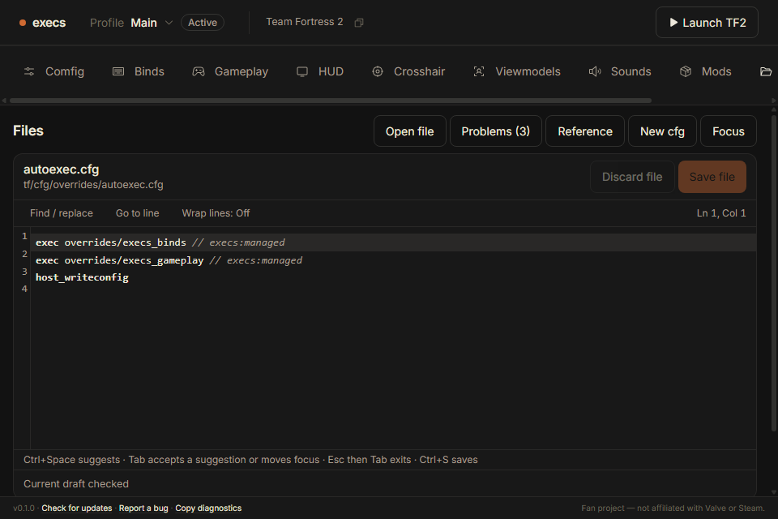
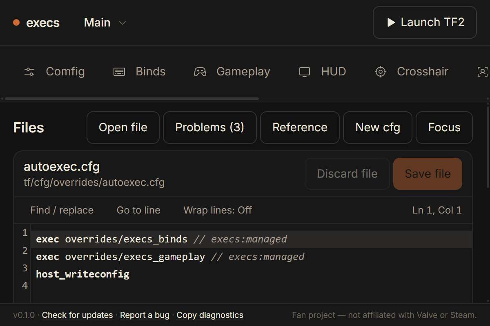

# Windows Files qualification

Passed job: [35489918663 / windows-host](https://github.com/rndaom/execs/actions/runs/35489918663/job/106022993945), source `b17309c171ee01665c85ced7ad53131ae482d288`. This includes the final provided-source focus fix `f6f1fb3`. September 20, 2026 UTC.

Windows Server 2025 Datacenter 10.0.26100, AMD EPYC 9V74, four exposed logical processors, WebView2 152.0.4191.66, NVDA 2026.2. The host uses production-transformed frontend modules, an isolated in-memory adapter and the exact product CSP response header. It is not the installed Tauri binary; packaged-origin verification is separate.

## Results

- Physical Tab enters and exits the editor. Ctrl+F opens search, Ctrl+Alt+G opens go-to-line, Ctrl+Space offers completion and Tab accepts it. NVDA's documented Insert+F2 pass-next-key gesture is needed for the search/dialog Escape checks; this reader-specific behavior is recorded, not hidden.
- All nine [authoring workflow stages](windows/workflows.json) pass: unsaved helper creation, numeric warning navigation, offline reference, exact Unicode/backslash/quoted-semicolon draft retention across two files, resolved exec navigation, both saves/reopens, search, go-to-line and focused read-only provided source. These stages use public DOM interactions; they do not claim physical keyboard-only traversal or real disk persistence.
- [Actual NVDA speech](windows/speech-excerpts.txt) includes named editor and instructions, `sensitivity · cvar` with concise provenance, the complete numeric warning and non-blocking explanation, `selected banana`, `Saved`, `Provided source · read-only`, and the named read-only editor with its search/navigation instructions. This is generated speech evidence, not an independent human screen-reader usability study.
- All four viewport captures completed. At 960×640 the Save control and editor remain visible; at 200% the CSS viewport is 600×400, controls remain legible and Save is visible, with vertical page scrolling and horizontal navigation scrolling. The 200% media override reports reduced motion and every recorded button transition is `0.00001s` (0.01 ms).

| Measurement | Result |
| --- | --- |
| Navigation start → editor plus settled analysis | 1,637.9 ms |
| Native keydown → second animation frame, comment typing | p95 30.7 ms / 64 samples |
| Physical Ctrl+Space → completion DOM | p95 68.2 ms / 21 samples |
| Representative 10k-line cold-worker analysis | p95 92.2 ms / 20 repeated samples |
| 1 MiB / 8 MiB comment byte limits | 53.7 / 144.9 ms |
| 1 MiB / 8 MiB dense commands | 179.3 / 831.1 ms, explicit incomplete analysis-budget findings |
| 256-file case | 25.9 ms |
| Sampled process-tree working-set maximum during benchmark | 974,802,944 bytes |

Every over-limit case refuses analysis. Dense stress maintains a maximum observed 17.5 ms UI heartbeat gap; this distinguishes asynchronous bounded analysis from a render-thread freeze. Fixture hashes and individual samples are retained in [worker-benchmark.json](windows/worker-benchmark.json). The proposed normal-edit <50 ms and representative analysis <500 ms targets are met on this runner. The dense 8 MiB stress case is separate from that representative target.

Readiness is not process-launch time; completion DOM is not compositor presentation; the second animation frame includes display cadence. Memory is sampled every 100 ms and counts shared pages in summed process working sets; it is not an absolute lifetime or unique physical-memory peak. No Windows Japanese IME acceptance is claimed. Actual Linux composition is qualified separately.

## Captures

Unmodified first-party fixture screenshots from the named CI job:

Full logs and the other viewports remain in that run's `files-native-windows` artifact. No real profile, Steam Cloud data or game process was used.
