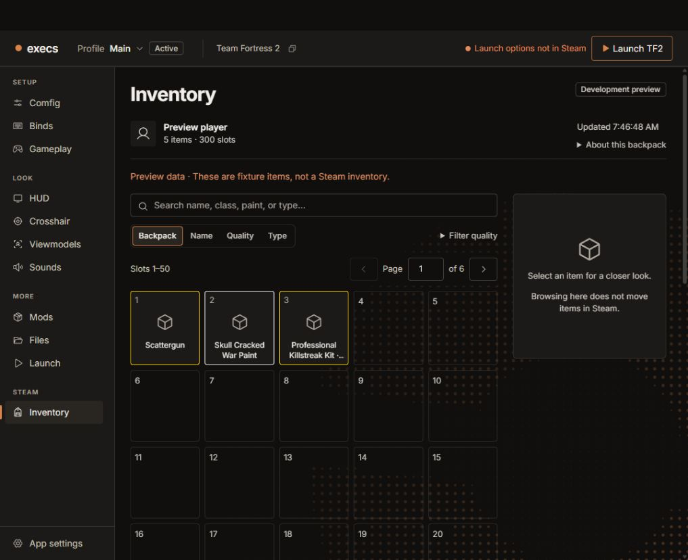
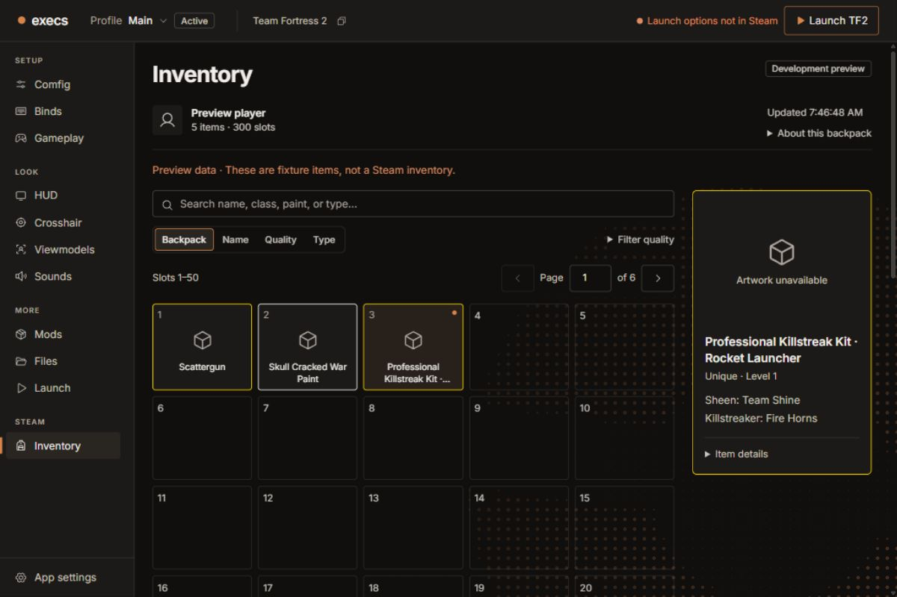
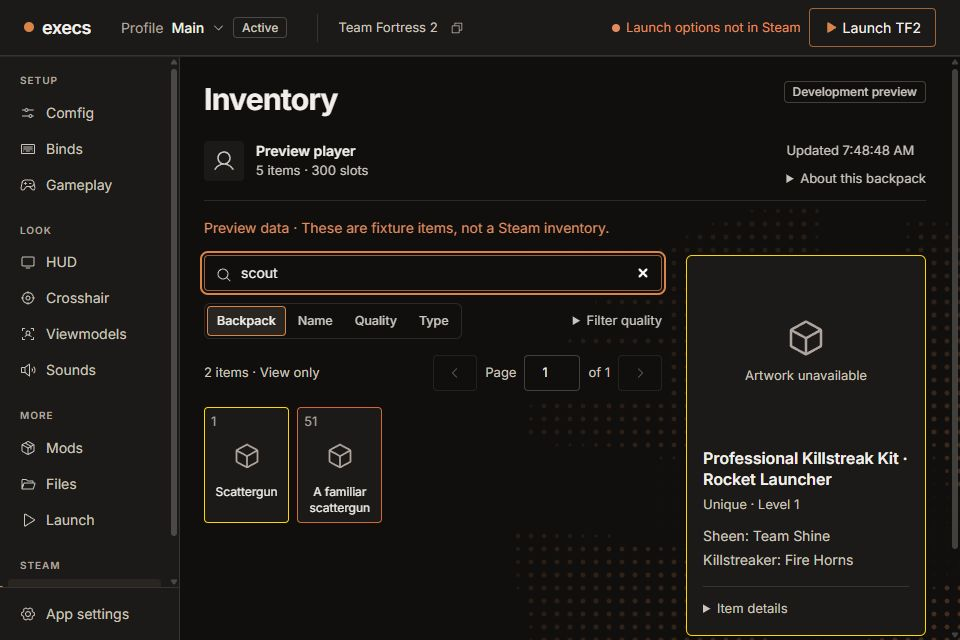
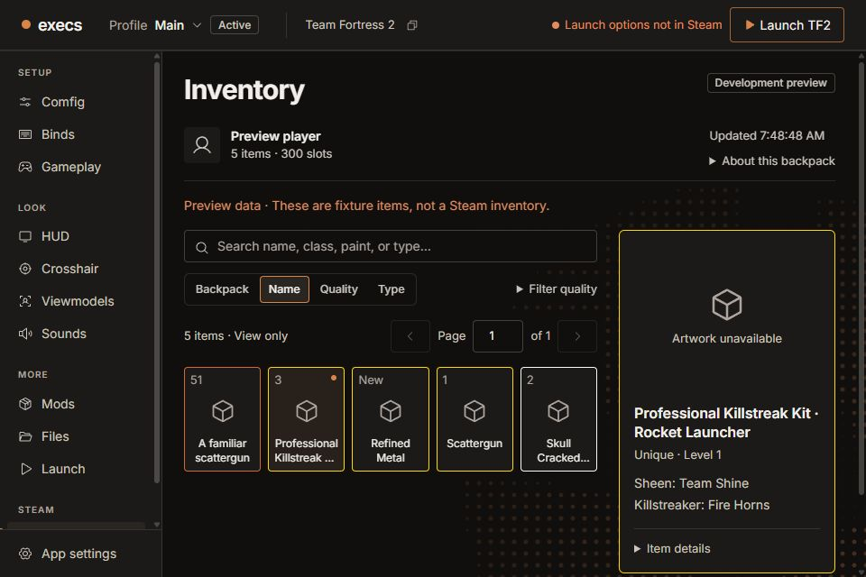

# Inventory audit and proposed 0.2.0 scope

Historical audit below. Follow-up sandbox implementation and current validation are in [IMPLEMENTATION.md](IMPLEMENTATION.md); use [TESTING.md](TESTING.md) for the runnable manager preview.

Audited September 27, 2026. Source: clean `main` at `acd39fb7`. This is an audit and implementation proposal, not a scope approval, feature implementation, or release authorization. Product files and external tracking were not changed.

## Verdict

Inventory is a working development-only **viewer**, not yet an item manager. It reads the signed-in Steam account, resolves installed TF2 metadata and artwork, and supports search, page jumps, quality filters and view-only sorting. There is no move, batch selection, arrangement draft, apply, craft, delete, equip or tool-use implementation.

To include an actual manager in 0.2.0, reopen the release scope and qualify a new candidate. My recommended expansion is **backpack organization first, then narrowly supported recipe-based crafting**. These need separate acceptance gates. Deletion and unrestricted item/tool operations should remain outside this first expansion. If crafting is a required 0.2.0 promise, the release waits for its gate; it must not silently become a later-release item.

## Current release position

- Live Linear inventory returned 37 issues in the 0.2.0 milestone: 36 Done, one In Progress ([RND-208, publication](https://linear.app/rndaom/issue/RND-208/validate-and-publish-the-combined-020-overhaul-and-profile-management)). None of the 171 returned project issue titles identified an Inventory/backpack/crafting workstream.
- PR #60 is merged into `main` at the audited commit. [Release PR #136](https://github.com/rndaom/execs/pull/136) is open at `8e77a2219683e0a4450f21d1aaf9ed7cef95c0b0`; its returned check runs succeeded.
- [Private candidate run 36313433526](https://github.com/rndaom/execs/actions/runs/36313433526) completed successfully on that release-PR commit. Build, Windows/Linux updater smoke and verification passed; publication was skipped. Updater signatures do not mean Windows Authenticode signing.
- The current RND-208 and milestone status explicitly supersede their older planning sections. RND-251 is Done, although its description still starts with an older September 24 checkpoint. Older local combined-release plans also describe now-completed work. Use dated current evidence, not those stale paragraphs, to assess readiness.
- Those passes qualify the existing scope. Inventory is hidden in release builds, so none establishes a working packaged Inventory manager or a live Linux Steam inventory session.

This audit did not repeat the entire application release matrix. It checked the current release records and GitHub run, inspected Inventory end to end in code, exercised its fixture UI, and reran focused tests.

## Capability gap

| Capability | Current execs | Proposed first manager |
| --- | --- | --- |
| Read backpack, persona, capacity, installed artwork | Implemented for development; historical Windows live-read evidence | Qualify current Windows and Linux sessions and packaged builds |
| Search, quality filter, name/type/quality view order | Implemented; never changes Steam positions | Keep view order distinct from arranging the backpack |
| Item details | Names, quality, level, classes and selected paint/kit/effect details | Add authoritative eligibility and restriction information needed for actions |
| Single move, swap, place new items | Absent | Draft moves with mouse and keyboard, explicit Apply |
| Select and move several items across pages | Absent | Persistent selected count, visible review, deterministic placement rules |
| Organize into groups / compact gaps | Absent | Preview exact destination slots and preserve protected items |
| Undo, saved layouts, history | Absent | Local draft Undo/Redo and Reset; account-bound saved layout and verified operation history |
| Crafting | Absent | Start with an explicit, validated metal-recipe allowlist; review exact ingredients and results |
| Delete, equip, tool application, trading | Absent | Separate future scopes; no implied support from adding moves/crafting |

[Jengerer's own documentation](https://www.jengerer.com/item_manager/) confirms single and batch movement, multiselection, new-item placement, ingredient-based crafting and confirmed single-item deletion. It lists sorting and blueprint selection as planned features, so they should not be described as existing JIM parity requirements. Reuse its interaction ideas and credit, not its unlicensed code/assets.

## Code findings

1. **Release gates are intentional and independent.** `src/lib/settings-ui.ts:43` excludes the sidebar; `SettingsHost.tsx:1527` excludes the pane; native commands reject non-debug builds in `src-tauri/src/commands/inventory.rs:109` and `:178`; `src-tauri/src/main.rs:5` gates the child entry point. Removing one gate cannot make a packaged manager work.
2. **There is no mutation transport.** The bridge exposes only `getInventory` and `getInventoryIcons`. `tools/inventory-probe/src/native.rs:291` handles welcome/cache/refresh/goodbye and returns a snapshot at `:319`. Its only sends are ClientHello and account-bound cache refresh. It does not process item create/update/destroy events into an ongoing operation result.
3. **The item contract is insufficient for crafting.** `protocol.rs:123` reads a limited item model; `:180` reduces the inventory field to a slot/unplaced result. The TypeScript item at `bridge.ts:15` contains no complete attribute or craftability/restriction contract. Quality/name/definition alone cannot establish that two items are safely interchangeable ingredients. Preserve and validate relevant native fields; unknown eligibility must refuse consumption.
4. **The existing foundations are useful.** Account-bound caches, string item IDs, duplicate-slot/identity rejection, bounded child lifetime/output, per-loop game/account guards, native write-gate serialization, installed metadata and bounded icon loads can be extended. Inventory remains separate from customization profiles.
5. **Refresh is suitable for browsing, not transaction authority.** Two-minute visible/focused polling, backoff and stale snapshots are implemented. Apply needs fresh native account/snapshot checks regardless of the displayed timestamp. Stop background reads competing with an operation, and verify authoritative results before success.
6. **No operation tests exist because no operations exist.** Passing viewer/parser tests cannot establish moves, crafting, partial acceptance, interrupted-operation recovery or Linux live connectivity.

The [existing rearrangement plan](../../design/2026-09-22-overhaul/implementation/inventory/rearrangement-plan.md) already identifies most of the move-safety requirements. It is a plan, not implemented functionality. The inventory README also has stale copy about a general Refresh button and failed-refresh clearing; the pane currently offers Retry after failure and retains stale snapshots.

## UI walkthrough captured in this audit

All images below are current browser fixtures, not the owner's Steam inventory. Fixture artwork is intentionally unavailable. Each saved image was opened and inspected. The compact capture was retaken after viewport settling.

### 1. Open Inventory — healthy viewer, unavailable in release

The Steam section distinguishes Inventory from profile panes. Capacity, slot numbers, search, view order and development status are visible. Five-column 50-slot pages require substantial vertical scrolling; unplaced items sit after the entire page. An organizer should expose new/unplaced items and cross-page destinations without requiring repeated full-page scrolling.

### 2. Inspect an item — works, no management actions

The 1200×800 capture shows selected-item feedback, kit target/name and effect details. There is no move, craft or use action. Long names truncate on cards but appear in full in details and accessible names. Missing fixture art is disclosed rather than fabricated.

### 3. Search across pages — works; selection scope needs attention before mutations

Searching `scout` returns slot 1 and slot 51 while the selected kit remains in the detail pane. That preserves inspection state, but future craft/delete actions must not silently act on filtered-out selections. Show the complete selected set, including hidden/off-page counts, in the operation review. At 960×640 the sidebar scrolls independently and details occupy much of the workspace; test the future action bar and keyboard path at this size.

### 4. Sort by name — works as a view, cannot organize Steam

The compact Name view contains five items with their original slot numbers and an unplaced item. `View only` correctly discloses the behavior. Add a separately named Arrange action with an exact change preview; do not make a view-sort control start writing positions.

Accessibility strengths visible in DOM/source include labeled search/page controls, item names containing quality and slot, pressed selection state, and status/error regions. A complete keyboard, screen-reader, contrast, zoom and native-WebView audit was not performed. The radio's visually hidden input did not respond to an automation click; its visible label did work. This is recorded as a targeting limitation, not an established user-facing sorting defect. Future drag/drop must have a keyboard equivalent, explicit destination announcements and a manageable focus model for large backpacks.

## Proposed implementation sequence and release gates

| Slice | Deliverable | What the owner can test | Exit gate |
| --- | --- | --- | --- |
| 1. Protocol and item model | Bounded operation session, authoritative attributes/restrictions, update reconciliation, fake coordinator | Deterministic success/conflict/disconnect/partial-result scenarios | Current protocol documented; no assumed server acknowledgement |
| 2. Organizer sandbox | Single/multi-select, move/swap/cross-page placement, arrangement preview, Undo/Redo/Reset | Complete fixture interactions with no Steam writes | Planner invariants, hidden selection handling, keyboard and both window sizes pass |
| 3. Verified live moves | Native review/apply, fresh baseline validation, bounded sends, result reconciliation, pending-operation recovery | Move a small explicitly chosen test set; inspect the result in TF2 and restore positions | Windows and Linux live results persist after reconnect/restart; interruption never falsely succeeds or blindly retries |
| 4. Basic crafting | Explicit supported recipes, exact ingredient review, eligibility/protection checks, output verification | Fake recipes first; then owner-confirmed disposable ingredients | Consumed IDs and acquired IDs reconcile; ambiguous, stale or unknown state refuses/requires reconciliation |
| 5. Release integration | Production gates, credits/help/changelog, release-mode tests, new private candidate | Actual NSIS/AppImage/deb candidate, not only debug/browser | Inventory platform acceptance and cumulative profile/updater regression qualification pass |

The first implementation work should branch from current `main`; the old integration branch has been merged/deleted. Keep each slice reviewable. Update AGENTS.md, the rearrangement plan and Linear's release scope when the owner selects the expansion; this audit does not overwrite the current read-only contract.

For planning, treat this as multiple implementation/qualification slices, not a last-minute UI toggle. A reliable calendar estimate depends on the protocol proof and access to test sessions on both platforms. Full JIM parity plus additional modern features is a larger release theme; it is not covered by finishing the organizer slice.

### Operation rules

- Layout drafts, favorites/protection, saved filters and layouts belong to the Steam account; profile switch/export never carries or applies them. Selection for inspection is separate from the reviewed operation set.
- Review includes account, original and target slots, all affected item identities, capacity and a baseline fingerprint. Apply rechecks these natively under the write gate, with TF2 closed. Preserve meaningful raw position flags; verify their encoding rather than writing a bare displayed slot by assumption.
- Validate ownership, unique IDs, unique final slots, valid capacity and bounded operation sizes. Specify occupied-slot swaps, insertion order, full-backpack behavior and handling of unplaced items. View sorting/filtering is never an implicit write plan.
- Keep a bounded local intent/outcome record before sending. After a disconnect or crash, reconcile with Steam and show confirmed/partial/unknown outcome. Never automatically replay a craft or claim that rolling back a local journal restores consumed items.
- Draft Undo is local. Reversing a successfully applied arrangement is a new reviewed move operation against current state; it can fail if inventory changed. Crafting has no Undo.
- Crafting starts with individually verified, explicit recipes. No wildcard recipe guess, automatic duplicate scrapping, or inferred craftability from display names. Protect favorites and decorated/customized items by default; unknown restrictions block use. Show effects on output restrictions where verified.
- Keep JIM-style deletion separate from crafting. Keep trading, market pricing, crate opening, tool application and loadout editing outside this proposal.

[Valve's Game Coordinator interface](https://partner.steamgames.com/doc/api/ISteamGameCoordinator) documents message transport, not a completed TF2 backpack transaction. [node-tf2's implementation](https://github.com/DoctorMcKay/node-tf2/blob/master/index.js) demonstrates position/craft message paths, while its [handlers](https://github.com/DoctorMcKay/node-tf2/blob/master/handlers.js) distinguish item updates/removal/acquisition and craft responses. These are useful protocol references, not proof that execs' local-Steam integration currently performs reliable writes. Verify the exact message IDs/envelopes and behavior before enabling them.

## Modern polish worth prioritizing

Prefer a visible selection tray, keyboard moves, move-to-page/slot, smart arrangement previews, protected items, saved searches, a readily accessible new-items tray and honest operation history. These directly improve organization and testing. Add duplicate grouping as a browsing aid before considering any consumption automation. Avoid promising a full rendered war-paint/effect preview; current installed art/swatches have documented limits.

## Verification and limits

Fresh checks on the audited source all passed:

| Check | Result |
| --- | --- |
| Inventory pure UI, React pane and snapshot hook | 15 tests passed |
| Standalone inventory helper | 7 tests passed |
| Core inventory metadata/artwork | 10 tests passed |
| Current browser walkthrough | Entry, inspection, class search and Name view verified; saved captures above |
| Existing private release candidate | GitHub reports success; publish skipped; this audit did not install it |

**32 focused tests passed.** No new real-account session, move, craft, deletion, Linux live session or release installation was performed. Historical Windows read evidence in `tools/inventory-probe/README.md` is distinguished from fresh audit evidence. Browser fixture images do not establish real artwork fidelity or native platform behavior.

See [TESTING.md](TESTING.md) for what can be tested now and the exact acceptance matrix for the proposed manager.
