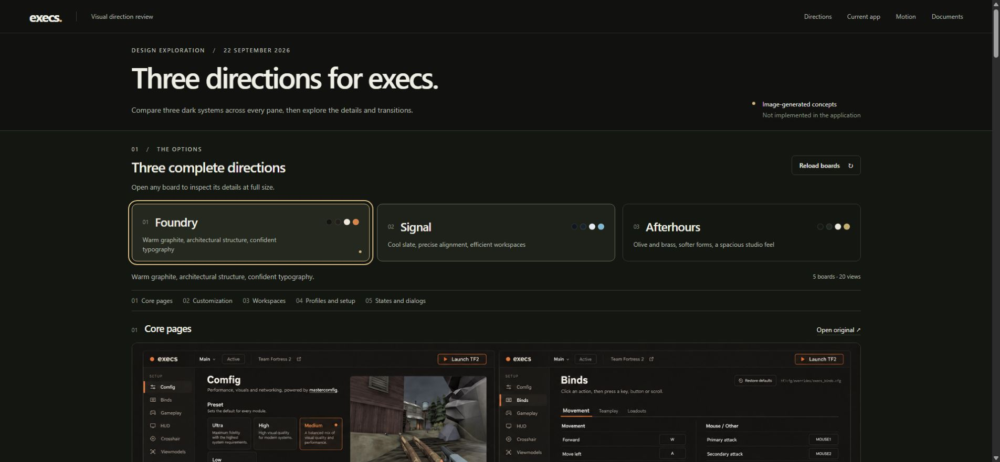
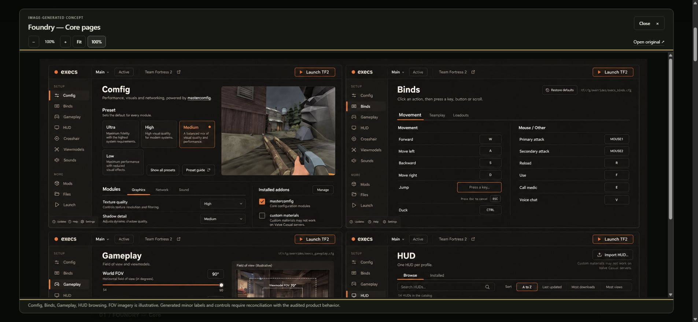
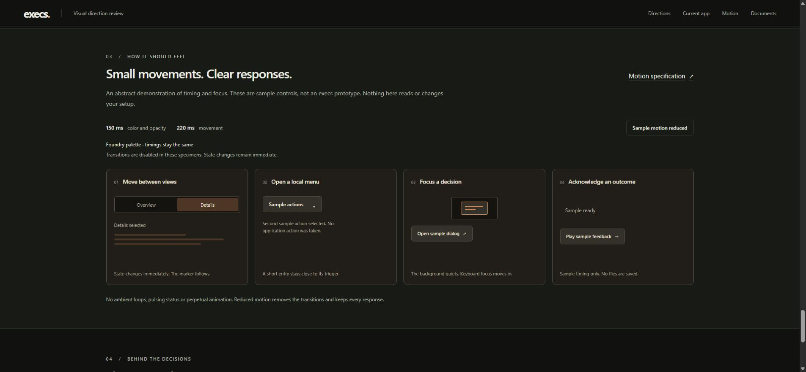

# Gallery accessibility and formatting verification

Verified September 22, 2026 against the local static gallery at `http://127.0.0.1:1424/`.

## Changes

- Replaced the lightbox's generic zoom group with a named `fieldset`; reset only its native spacing/border so the existing toolbar layout is preserved.
- Replaced the generic image stage with a named `section`. It remains keyboard-focusable for arrow-key panning. A scoped lint explanation preserves this deliberate scroll-region accessibility behavior.
- Gave the original-image anchor a valid initial local asset URL; opening any concept or evidence image still replaces it with that exact source.
- Made the sample dialog's close button explicitly `type="submit"`, preserving the native `method="dialog"` close action.
- Changed the two `forEach` callbacks to block bodies, removed redundant strict-mode syntax, and formatted only gallery JS/CSS and the design folder's JSON records.
- Retained hidden-state and reduced-motion overrides, with narrow lint explanations for their necessary CSS precedence.

No product source, generated image, source capture, release policy or external data was changed by this gallery task. All nine JSON files had identical parsed data before and after formatting; canonical hashes are in [gallery-json-data-preservation.tsv](gallery-json-data-preservation.tsv). Later authorized planning updates may intentionally change planning-status.json; that does not change the formatting-only comparison recorded here.

## Checks

- `pnpm exec biome check docs/design/2026-09-22-overhaul --max-diagnostics=100`: **pass**, 12 files, no errors or warnings. [Log](gallery-biome-check-20260922.log)
- `node --check docs/design/2026-09-22-overhaul/gallery.js`: **pass**.
- Scoped `git diff --check`: **pass**.
- Chrome browser control used the local gallery through CUA. All three direction tabs worked, including Right and Home keyboard navigation; exactly one five-board panel was visible.
- The accepted-capture filter displayed **66** cards, excluding the rejected record. All **13** surface groups expanded/collapsed; the individual Comfig disclosure remained usable.
- A Foundry concept and captured Comfig evidence both opened in the lightbox with the correct accessible title and original-file URL. Images decoded successfully.
- Lightbox 100%, zoom in to 125%, zoom out to 100%, and Fit worked. The image region received keyboard focus; ArrowDown moved its scroll position from 0 to 40 pixels. Escape closed it and restored focus to its exact opening button.
- The sample dialog focused its explicit submit button, closed normally, and restored focus to the opener. The sample menu accepted keyboard Down/Return, reported its selected action and restored focus to its trigger.
- Reduced sample motion produced a 0-second indicator transition and no view animation while Details still selected. Restoring normal motion returned the 0.22-second transition.
- The simulated feedback reached “Sample complete” and re-enabled its control. Reload boards retained Foundry selection and restored its enabled state.
- Browser console showed no captured warnings or errors during this check.

These are static review-gallery checks. They do not qualify native execs, Linux, packaged installers, Steam Cloud, actual game behavior or release readiness.

## Screenshots

