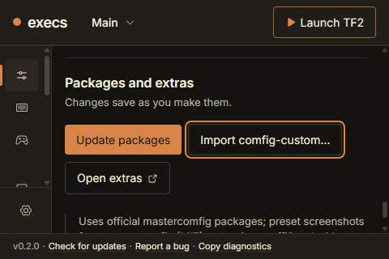
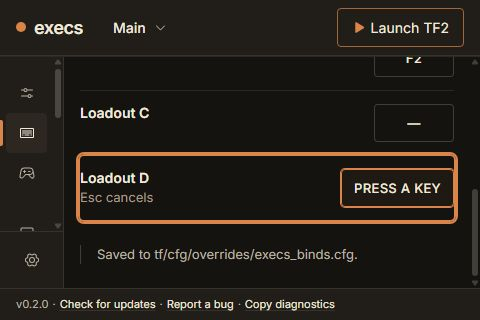
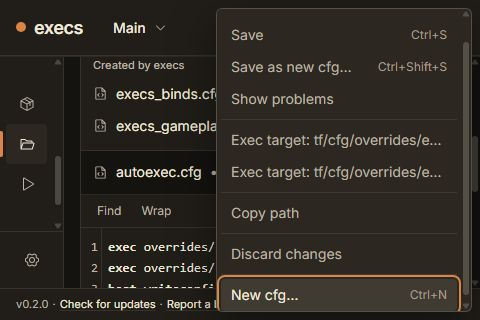
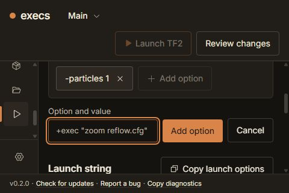
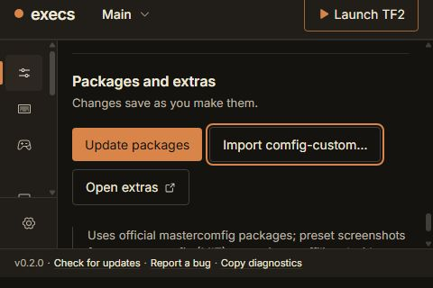
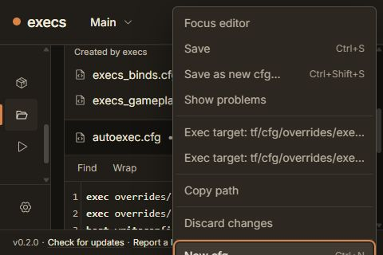
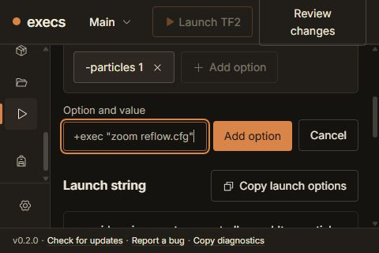

# Foundry CSS reflow qualification

Reviewed on 2026-09-22 at effective **600 × 400** and **480 × 320** CSS viewports. These represent the available layout space at 200% enlargement of 1200 × 800 and 960 × 640 windows. They are **CSS reflow checks in Chrome**, not evidence of native Tauri zoom, Windows display scaling, Linux WebKit rendering, or a screen-reader audit. The in-app browser was attempted and reported unavailable; the coordinating agent approved the Chrome fallback.

The four requested workspaces remain usable with keyboard input and normal scrolling. The audit found and fixed four issues in three shared areas. There are no unresolved confirmed P1/P2 issues in the exercised flows. Changes to the shared files were coordinated with the root agent before editing.

## Flow evidence

All screenshots below were captured in this run, saved, visually inspected, and checked for exact PNG dimensions. `capture-dimensions.json` records every image's size. The temporary viewport override was reset and the audit tab closed after verification.

| Step | Task and result | 600 × 400 evidence | 480 × 320 evidence |
| --- | --- | --- | --- |
| 1 | **Comfig — usable after root-scroll fix.** Preset tiles fit; arrow keys switch module categories; module options wrap. Space changes an addon. Tab reaches every addon and the Update packages, Import, Open extras and footer actions. | `01-comfig-600-start.png`, `11-comfig-600-bottom-fixed.png` | `04-comfig-480-preset-keyboard.png`, `05-comfig-480-module-selected.png`, `12-comfig-480-bottom-fixed.png` |
| 2 | **Binds — usable.** Home/End selects categories. Enter starts recording; a key records Loadout D; Escape cancels Duck capture. The recorded binding remains after visiting Files/Launch and resizing. | `09-binds-600-start.png`, `10-binds-600-recording.png` | `07-binds-480-start.png`, `08-binds-480-recording.png` |
| 3 | **Files — usable after menu fixes.** File list, New cfg, helper destinations, editor, Find, Save and Discard remain reachable. A draft survives pane navigation and resizing; explicit Save completes. The code editor retains its bounded scroll surface. Menu End/Home scroll to their respective actions and Escape returns focus to File actions. | `19-files-600-new-helper.png`, `20-files-600-editor-saved.png` | `13-files-480-start.png`, `14-files-480-editor-draft.png`, `15-files-480-find.png`, `21-files-480-menu-end-fixed.png`, `29-files-480-escape-focus.png` |
| 4 | **Launch — usable after narrow-header fix.** An unsubmitted quoted addition survives pane navigation and resizing. Enter adds it; Copy returns the exact string; Write to Steam awaits the existing fixture result. The raw editor, status and removed-options disclosure are keyboard reachable. | `25-launch-600-unsubmitted.png`, `26-launch-600-retry.png` | `16-launch-480-start.png`, `23-launch-480-unsubmitted-fixed.png`, `27-launch-480-string.png`, `28-launch-480-guidance.png` |

Representative final states:

`03-comfig-600-bottom-actions.png` is rejected as bottom-action evidence: the compositor captured the earlier addon position after a batch of Tab actions. Later captures use separate interaction and screenshot calls. Its dimensions are valid, but its filename does not describe the visible state.

## Findings fixed

### P2 — keyboard navigation scrolled the whole application

Absolutely positioned screen-reader labels in the navigation and pane content lacked local containing blocks. At the minimum viewport, sidebar headings extended past the scroll region; Comfig's hidden labels and legends could increase the HTML scroll height to 1421 pixels. Tabbing through addon/package/footer controls then moved the whole page, clipping the application header.

`index.css` now gives `.settings-nav` and `.settings-content` relative positioning. This contains their absolute descendants without creating a containing block for fixed dialogs. It does not change the intended Files editor scrolling.

The same Comfig keyboard sequence was repeated before and after the change. Before, workspace top moved from 45 to -127 pixels as focus advanced. After, every recorded step kept `window.scrollY = 0`, HTML height equal to the viewport height, and workspace top at 57 pixels. At 480 × 320, the package-action check changed from HTML height 1421 / root scroll 12 to HTML height 320 / root scroll 0.

Detailed focus rectangles are in `keyboard-geometry-before.json` and `keyboard-geometry-after.json`.

### P2 — the Files action menu extended below the viewport

At 480 × 320 the menu was 334 pixels high, from y = 8 to y = 342. End focused New cfg at y = 305, leaving part of the action below the viewport. A height limit alone also exposed late analysis: new exec-target rows grew the menu after its initial placement, leaving its bottom at y = 355.

`ContextMenu` now has a viewport-relative maximum height and vertical scrolling. A ResizeObserver and resize listener refresh placement when content or viewport size changes, preserving current focus. After analysis adds rows, the menu remains y = 8 to y = 312, height 304. End scrolls its final item to y = 279, height 32; Home returns to the first item. The surrounding application keeps root scroll 0.

### P2 — Escape lost the menu opener under StrictMode

React StrictMode's repeated effect setup captured the menu's first item as its own return-focus target. Closing the menu therefore left focus on the body. The effect now retains the original outside opener when setup repeats. Browser verification after Escape reports `data-testid="files-actions"` as the active element; the final focus outline is visible in `29-files-480-escape-focus.png`.

### P2 — pending Review changes clipped inside the narrow header

With an unfinished Launch addition at 480 pixels, Review changes wrapped to 61.375 pixels inside a fixed 56-pixel header. Its top was -3.1875 and bottom 58.1875, clipping the button and overlapping the workspace.

Below the existing `sm` breakpoint, `ReadyHeader` can wrap its action group onto another row, and the review label stays on one line. The same pending state now has a 100.6875-pixel header and a 39.6875-pixel review button from y = 52 to y = 91.6875. The workspace retains scrolling; its draft stays unchanged. The normal desktop header classes remain unchanged above the breakpoint.

The measured Profile menu anchor still fits: at 480 × 320 its panel is x = 34, y = 54, width 430, height 250, with internal scrolling for its remaining content. See `24-profile-menu-480-wrapped-header.png`.

## Reference comparison and limits

The saved final screenshots and Foundry `01-core.png` / `03-workspaces.png` were inspected together. The warm surfaces, typography, hairline rows, token treatment, editor surface and explicit actions retain the selected direction. At these effective widths, columns become vertical flows and the navigation uses its existing compact form. This audit made no changes to typography, color tokens, pane persistence, write contracts, source assets or native code.

Across the final checks, document width equals viewport width. The workspace's scroll width equals its client width: 526 at 600 pixels and 406 at 480 pixels. Code text may scroll within Files' intentional editor surface; interface controls do not require sideways scrolling. Representative control rectangles, keyboard actions, live draft state and screenshots were checked rather than treating screenshot appearance alone as proof of interaction.

The browser fixture writes only preview state. Its Steam result is `steam_open`; no real `localconfig.vdf` was written, no game was launched, and no native zoom claim comes from this run. External imports, OS pickers and backend side effects are outside this bounded reflow audit. The final browser log had no warnings or errors.

Validation: three targeted ContextMenu tests pass, covering late-content/viewport placement with focus preservation and observer cleanup, keyboard navigation, and StrictMode opener restoration. TypeScript and Biome pass. No unchanged pane suites or full test suite were rerun.
